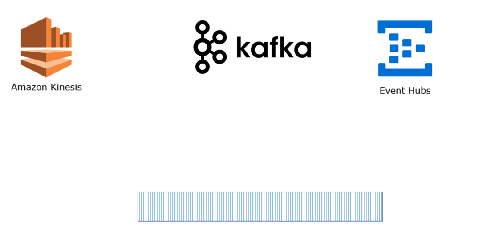

# Event driven architecture

<em class="sub-heading">-</em>

By Per Ökvist ([@per_okvist](https://twitter.com/per_okvist/)) 
Please give feedback and report issues on the [GitHub repository](https://github.com/perokvist/event-driven-architecture/)

---

In this article we'll explore EDA through mainly "Event-based State Transfer", [Martin Fowler's event patterns](https://martinfowler.com/videos.html#many-meanings-event).
In the examples services/compontents will collaborate through events. The service/component defention we're using is as follows.

### Service / Component

[source of inspiration](http://media.abdullin.com/blog/2015/2015-03-18-edd-eBay-Barcelona.pdf#page=23)

Each service could react to events, handle requests/response and emit events.
Requests could be commands or queries. Responses could be only status codes or results, the request/response could by sync or async, eventual consistent or not. The defenition stays the same and these options are implementation details.

### Logs

This article will also look at integration between services using logs.

Log characteristics as append only, ordered events (in partion) and offsets, could easaly be compared with a file(s). Pushing position and ack/"checkpointing" to the clients, removing broker concepts centraliced subscriptions and deadletter etc.

Using logs as integration or/and as a form of persitant model, introduces new patterns when working with events. These options are going to be explored further in this article.

Dispatcher
https://gist.github.com/yevhen/7682490
8-lines of code
