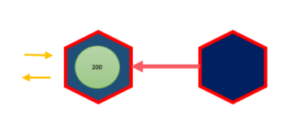

# Event driven architecture

<em class="sub-heading">-</em>

By Per Ökvist ([@per_okvist](https://twitter.com/per_okvist/)) 
Please give feedback and report issues on the [GitHub repository](https://github.com/perokvist/event-driven-architecture/)

---

In this article we'll explore EDA through mainly "Event-based State Transfer", [Martin Fowler's event patterns](https://martinfowler.com/videos.html#many-meanings-event).
In the examples services/compontents will collaborate through events. The service/component defention we're using is as follows.

### Service / Component

[source of inspiration](http://media.abdullin.com/blog/2015/2015-03-18-edd-eBay-Barcelona.pdf#page=23)

Each service could react to events, handle requests/response and emit events.
Requests could be commands or queries. Responses could be only status codes or results, the request/response could by sync or async, eventual consistent or not. The defenition stays the same and these options are implementation details.

### Logs

This article will also look at integration between services using logs.

Log characteristics as append only, ordered events (in partion) and offsets, could easaly be compared with a file(s). Pushing position and ack/"checkpointing" to the clients, removing broker concepts centraliced subscriptions and deadletter etc.

Using logs as integration or/and as a form of persitant model, introduces new patterns when working with events. These options are going to be explored further in this article.

### 1. 2PC

A common challange when emiting changes/events is do drive the local state and publish the events in a "safe" manner. If the service updates local state first in one transaction then writes the events to a log or a broker in another transaction, you have to deal with two transaction. So you need a "two phased commit" - [two phased commit](https://en.wikipedia.org/wiki/Two-phase_commit_protocol)
Not dealing with this could mean loosing data/events.

When both transaction complete could could return 200 ok to clients.
If this has business implications we would like to remove this complexety.

### 2. Polling

Another variant is to poll the source of events. This allows local state to be written, but the producing service doesn't publish the events. Instead the consumer polls based on time or offset. The consumer keeps track on the time or offset that is last polled the producer.
This variant introduces coupling between producer and consumer, as well as potential global offset for the producer, and increased traffic.

### 3. Single publisher

This variant has alot in common with polling. Here a publisher does the polling and then publihses the events. But due to that the publisher needs to keep track of the offset and publish the events, 2PC challanges comes back tough the implication is offen that the same event could be published twice.

### 4. Log subscription

In this variant we only write to the log, and then reads the log to update local state. This way we only have one transaction when writing to the logs.
This have simularities with using logs to avoid dual writes as detailed in [kafka dual writes](https://www.confluent.io/blog/using-logs-to-build-a-solid-data-infrastructure-or-why-dual-writes-are-a-bad-idea/).

This variant also has alot of tweak how we could respond to command from http requests. We could hide the async implementation or embrace it.

#### 4.1 
We could expose our async implementation, through responding 204 when we recive the command.
#### 4.2
We could return 200 ok, when we have written to the logs.
#### 4.3 
We could wait and return 200 ok when we have updated the local state. This also gives us an option to return the result.

#### Concurrency
Responding to the client is one thing, but waht about multiple command targeting the same instance? This also is an implementation detail, if the use cases needs it, we could use locks. In the response scenario above we use the same locks to determine when we complete.

### 5. The log is the database and the db is cache

The final variant is to treat the log as our database. This could be done using infinite retention (Kafka only) or some form of snapshoting, preferably log compacation (kafka only).

Then all other representations of the current state is views/projcations or cache of the current State

#### Idempotency

Due to that events are ["Event-based State Transfer"](https://martinfowler.com/videos.html#many-meanings-event) events, not [CRDT](https://en.wikipedia.org/wiki/Conflict-free_replicated_data_type) events and common infrastructure is at-least-once delivery. Idempotency on the consumer side becomes important as do order.

----
TODO

Dispatcher
https://gist.github.com/yevhen/7682490
8-lines of code
