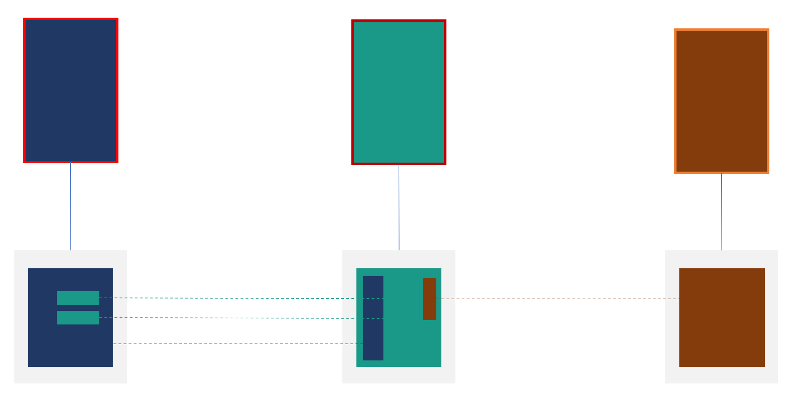
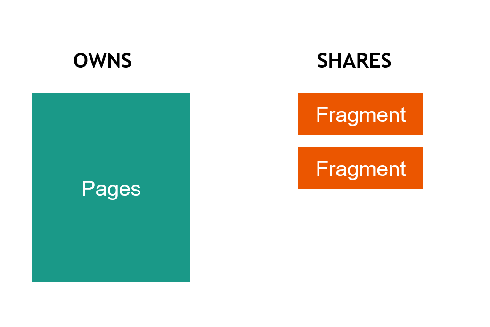
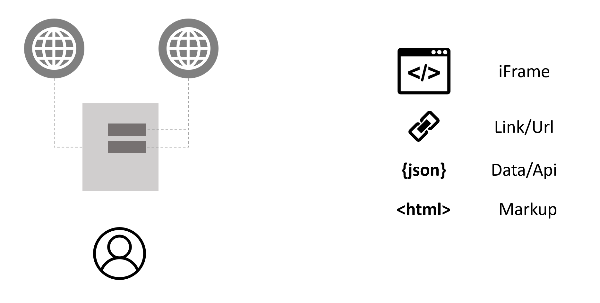

## Introduction

[Self contained systems](scs-architecutre.org) - SCS is a decomposition style, where a set of verticals forms a system. Each vertical being a independent self contained system.
“Each SCS must include data and logic. To really implement any meaningful features both are needed. An SCS should implement features by itself and must therefore include both.”
SCS favours UI integration trough composition, where each vertical owns all interfaces/UI, aligning service and UI ownership. 
SCS it self doen't imply which composition style to use.

Using this approch avoids a monolithic frontend with it's pros and cons.
Each vertical could then use an architecture and tech stack suitable for it's needs.



## Composition

To aid reasoning about composition, let establish a few builing block to help. Pages and fragements.
Pages are owned a produced by the team owning a vertical. Builing block for sharing a part/component is called a fragment.
“Teams should publish a catalog of their fragment types and fragment instances”.



### Transclusion

[Transclusion](https://en.wikipedia.org/wiki/Wikipedia:Transclusion) is the inclusion of part or all of an electronic document into one or more other documents by hypertext reference. 

The result of transclusion is a single integrated document made of parts assembled dynamically from separate sources, possibly stored on different computers in disparate places.

### Options

The web provider a few established options to integrate different systems.



Iframe is a good "sandboxing" techique, but the frame part i challanging.
Links most is commonly used, and a great option if possible. Http Api's is what might leads us to a monolithic front end, a backing option for fragments but not the main part for integration.
Markup is great, but we need help with transclusion.
Our mental model could be compared to a frameless iframe with pre-rendered markup.

If composition and what composition strategy to be used depends on what kind of system you're building.
When researching options you'll find three main options

- Zalando's Tailor
- Akamai's ESI (edge side include)
- Custom, WebComponents/JS, JS lib components

This article will focus on transclusion using [ESI](https://www.akamai.com/uk/en/support/esi.jsp). 

### ESI

"ESI provides a mechanism for managing online content transparently across application server solutions, content management systems and content delivery networks".
As stated ESI might be best fit for content, or simpler behavior, when another stategy might fit components with richer behavior.
Behavior might also be best to do as [progressive enhancement](https://en.wikipedia.org/wiki/Progressive_enhancement).

[Micro service websites](http://microservice-websites.netlify.com/) gives us a set of "rules" to aid implementation of our ESI strategy.

The simplest for of ESI looks like this.

```
<esi:include src="xxxx.html"></esi:include>
```

A CDN or middleware with ESI capability will parse and include the document referenced. This is done server side. This also honors the cache header of the source, adding great caching capablities and composition close to the client!
Also giving the producing system/team ownership of caching.

But a fragment may contain both markup, styling and scripts.

- your_fragment_styles.html
- your_fragment_scripts.html
- your_fragment.html

This make a fragment of three parts[^1] all to me includes through esi:include in the suitable places on a page.

[^1: ]Note that all parts are .html. Giving the producer ability to control tags and cache-busting.

To make fragments "stand alone" components, there are some rules. There can be described as tranclusion's [context neutrality](https://en.wikipedia.org/wiki/Transclusion#Context_neutrality).
A fragment should have no dependency on the page it's included on, nor any other fragment.
It doesn't have the "sandbox" of the iframe, making all runtime dependecies or global decalarations a dependecy that is not allowed. This means that the only allowed runtime is the default one - the browsers implementation of ECMA script - [vanillajs](http://vanilla-js.com/).
It's tempting to argee on a common runtime for all, but this introduces instability, release trains and  removes the self contained, agility, localized decisions of each team/vertical.

The same temptation might occur regarding styling. A [style guide](https://en.wikipedia.org/wiki/Style_guide) is the best way of approcing a common ground without removing the pros of beeing self contained, agilety, localized decision of each team/vertical.

The options on page level is not the same, pages is not shared and own by a vertical/team. All depenencies on page level are local.

### h-include

ESI is for server side inclusion (SSI). To include pre-redered content on the client, client side inclution (CSI) could be used. [h-include](https://github.com/gustafnk/h-include) is a declarative client-side inclusion for the Web, using Custom Elements.

Due to its similarity to ESI it a perfect match for combining.

```
<h-include src="xxxx.html"></h-include>
```

## Sum of the parts

With support for both SSI and CSI with a similar approch, you could do quite powerfull optimization and choices for your solution.

To be able to deffer loading, "go through caching" with CSI, optimize below the fold etc you stepped up your mix and match game. All with great caching abillites, optimizing for relevant and change rate of content.

### Performance budgets

Performace is UX. When working in verticals consuming other vertical/teams fragments, doing so within your page expectations might be crusual.

Introducing performace budgets for mission critical veticals is good to keep good performance. This also show the costs for resources, using scripts, parsing javascript etc. This is often an eye opener for time to action, especially on mobile devices.

[Start Performance Budgeting](https://addyosmani.com/blog/performance-budgets/)

### SEO

Keeping content as just content, rendered by the server could aid you in creating a better SEO strategy.

- [Javascript SEO](https://www.elephate.com/blog/ultimate-guide-javascript-seo/)
- [The cost of javascript](https://medium.com/@addyosmani/the-cost-of-javascript-in-2018-7d8950fbb5d4)

### Caching